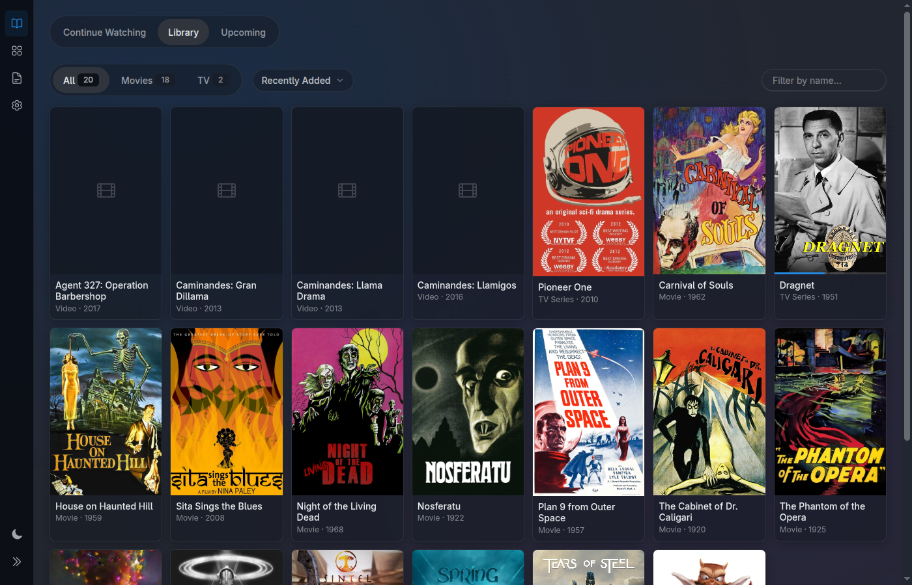
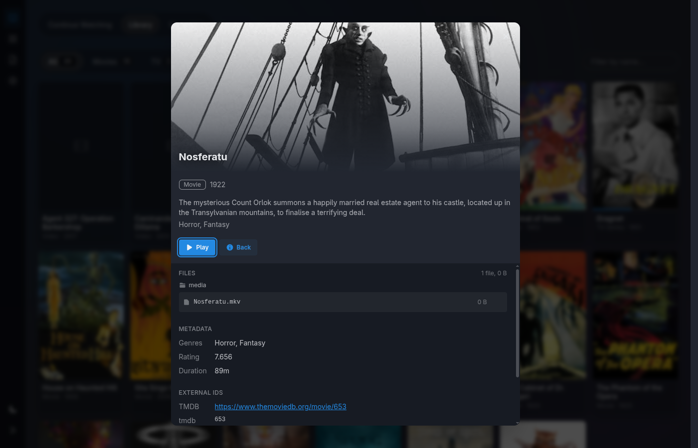
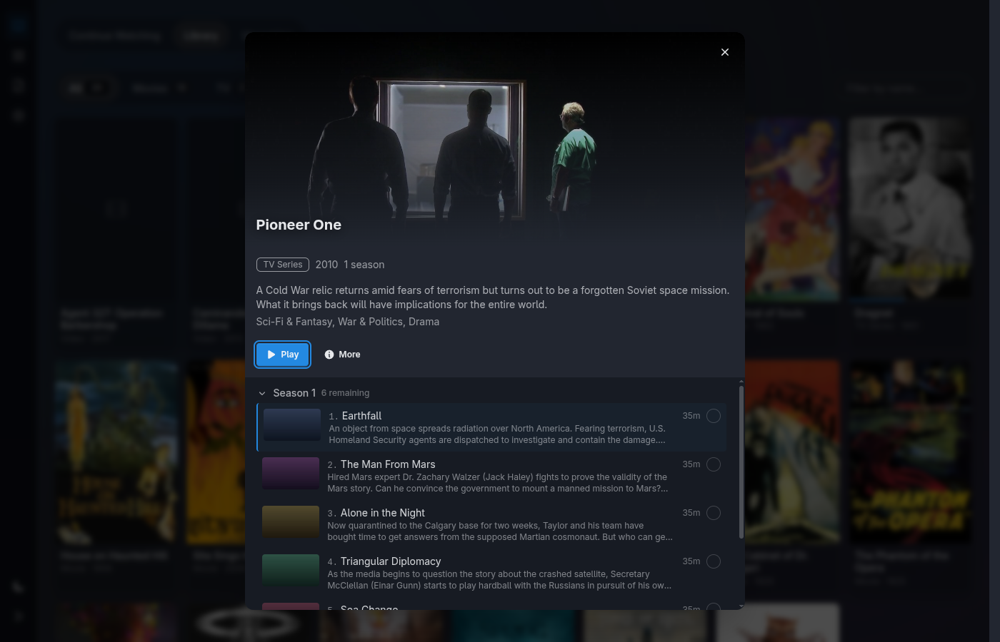
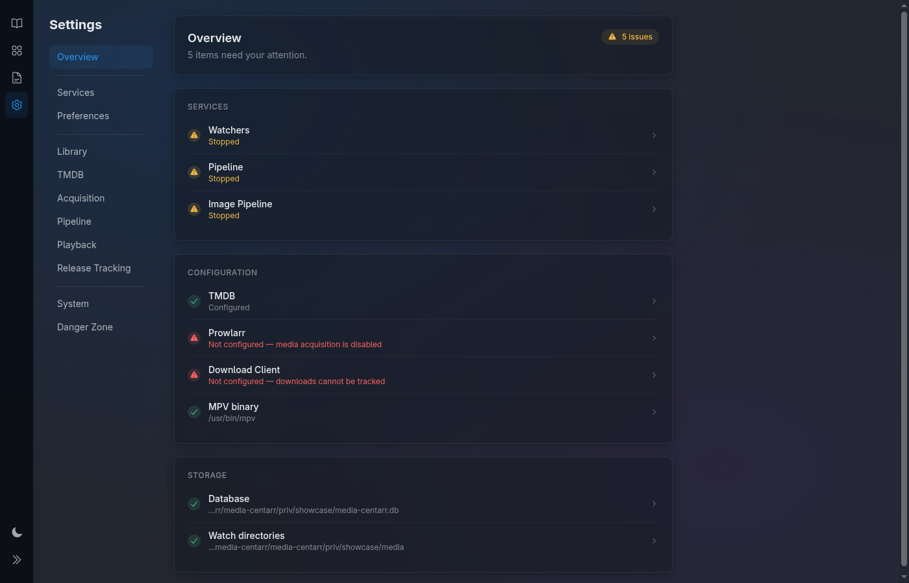

<div align="center">

<picture>
  <source media="(prefers-color-scheme: dark)" srcset="https://raw.githubusercontent.com/media-centarr/media-centarr/main/priv/static/images/centaur-logo-light.png">
  
</picture>

# Media Centarr

**Library management and playback for your personal movie and TV collection — the \*ARR stack and a couch-ready player in one self-hosted Linux app.**

  

Point it at your video directories. It identifies your movies and TV shows via TMDB, downloads artwork, tracks your progress, and plays everything locally through mpv — all from a real-time browser UI designed for a TV across the room.

Zero-config SQLite. No Docker. No transcoding server. No accounts. No cloud.

**🌐 [Visit the site](https://media-centarr.github.io/media-centarr/) &nbsp;·&nbsp; 📖 [Read the docs](https://github.com/media-centarr/media-centarr/wiki)**

</div>

> [!WARNING]
> **Alpha.** Functional for daily use but under active development. Expect rough edges and occasional breaking changes between releases.

---

<div align="center">







</div>

---

## What it does

- **Library management** — watches your directories for new video files, identifies movies and TV shows via TMDB, and downloads artwork automatically. Low-confidence matches wait for manual review instead of polluting your library with wrong guesses.
- **Playback** — launches mpv on the local machine, tracks your progress, resumes where you left off, and auto-advances to the next episode.
- **Release tracking** — monitors TMDB daily for upcoming movies and new TV seasons tied to the shows in your library.
- **Acquisition** *(optional)* — search and queue downloads via Prowlarr. Entirely optional: Media Centarr is a full library manager without it.
- **Couch-first UI** — keyboard *and* gamepad navigation, large artwork, dark-first. Built to drive a TV from across the room.
- **Real-time** — every change (new file, metadata fetched, playback started) appears instantly via Phoenix LiveView. No polling, no refresh.

## Non-goals

Media Centarr is deliberately **not** a streaming server or cross-platform media suite. It does not stream to remote devices, transcode, run in Docker, or support multiple users. If you need those, [Jellyfin](https://jellyfin.org/) and Plex do them well.

See the [FAQ](https://github.com/media-centarr/media-centarr/wiki/FAQ) for the full list and reasoning.

---

## Install

```sh
curl -fsSL https://raw.githubusercontent.com/media-centarr/media-centarr/main/installer/install.sh | sh
```

Downloads the latest release, verifies its checksum, installs atomically under `~/.local/lib/media-centarr/`, generates a `SECRET_KEY_BASE`, and sets up a systemd user unit.

Full installation guide, manual install, update, and uninstall: **[Wiki → Installation](https://github.com/media-centarr/media-centarr/wiki/Installation)**.

## Requirements

- SQLite3, mpv, inotify-tools
- A free [TMDB API key](https://www.themoviedb.org/settings/api)

**Arch:** `sudo pacman -S sqlite mpv inotify-tools` &nbsp;·&nbsp; **Debian/Ubuntu:** `sudo apt install sqlite3 mpv inotify-tools`

---

## Documentation

All end-user documentation lives in the **[Wiki](https://github.com/media-centarr/media-centarr/wiki)**:

- [Getting Started](https://github.com/media-centarr/media-centarr/wiki) — install, first run, add your library
- [Using Media Centarr](https://github.com/media-centarr/media-centarr/wiki) — browsing, playback, keyboard & gamepad, review queue
- [Setup Guides](https://github.com/media-centarr/media-centarr/wiki) — TMDB, Prowlarr, backup & restore, running as a service
- [Reference](https://github.com/media-centarr/media-centarr/wiki) — settings, FAQ, troubleshooting

---

## For contributors

```bash
git clone https://github.com/media-centarr/media-centarr.git
cd media-centarr
mix setup
mix phx.server
```

Architecture, pipeline internals, input system, and other developer documentation live in [`docs/`](docs/) and [`AGENTS.md`](AGENTS.md). Decision records are in [`decisions/`](decisions/).

---

## License

[MIT](LICENSE) — Copyright (c) 2026 Shawn McCool

## Acknowledgments

<a href="https://www.themoviedb.org">
  
</a>

This product uses the TMDB API but is not endorsed or certified by TMDB.
