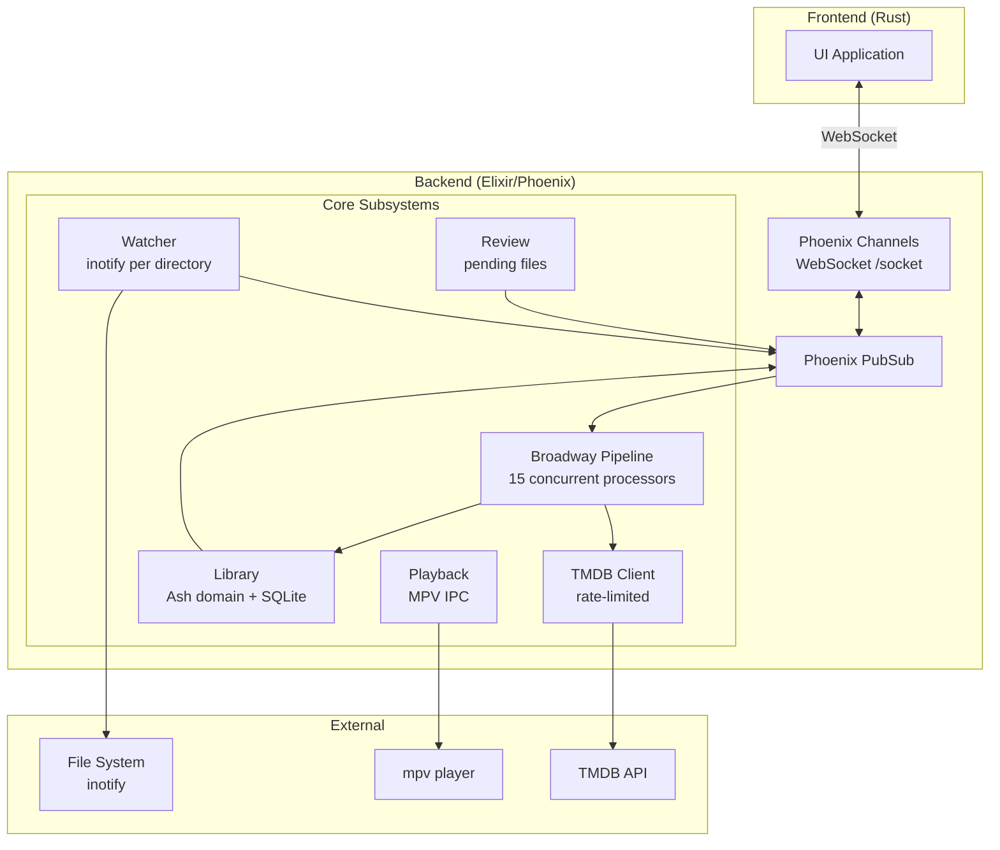
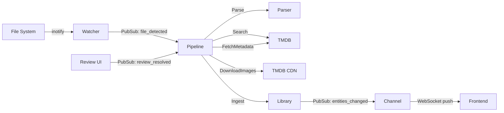
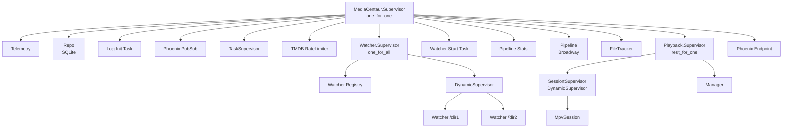

# Architecture

Media Centaur Backend is a Phoenix/Elixir application that watches directories for video files, enriches them with TMDB metadata and artwork, and serves the library to a Rust frontend over WebSocket.

## System Overview

## Data Flow

## Supervision Tree

Children start in order. Watcher and Pipeline are conditionally disabled in test environment.

## PubSub Topics

All inter-component communication flows through Phoenix PubSub:

| Topic | Events | Publishers | Subscribers |
|-------|--------|------------|-------------|
| `pipeline:input` | `file_detected`, `review_resolved` | Watcher, Review UI | Pipeline Producer |
| `library:updates` | `entities_changed` | Pipeline batcher, FileTracker | LibraryChannel |
| `library:file_events` | `files_removed` | Watcher | FileTracker |
| `watcher:state` | `watcher_state_changed` | Watcher | FileTracker |
| `playback:events` | `playback_state_changed`, `entity_progress_updated` | MpvSession | PlaybackChannel, Manager |
| `review:updates` | `file_reviewed` | Pipeline | Review LiveView |

## Key Principles

- **Ash is the only data interface.** All reads and writes go through Ash actions — no raw SQL, no `Ecto.Query`, no `Repo` calls.
- **Schema.org vocabulary.** Entity fields use schema.org property names.
- **UUIDs are permanent.** Entity IDs never change once assigned.
- **PubSub for cross-context communication.** Contexts don't call into each other's internals.
- **Pipeline is a mediator.** The pipeline actively orchestrates — domain resources don't trigger pipeline behavior.

## Specifications

Cross-component contracts live in `../specifications/`:

| Spec | Governs |
|------|---------|
| [API.md](../../specifications/API.md) | Phoenix Channels WebSocket protocol |
| [DATA-FORMAT.md](../../specifications/DATA-FORMAT.md) | JSON-LD entity serialization format |
| [IMAGE-CACHING.md](../../specifications/IMAGE-CACHING.md) | Image storage conventions |
| [PLAYBACK.md](../../specifications/PLAYBACK.md) | MPV integration and progress tracking |
| [COMPONENTS.md](../../specifications/COMPONENTS.md) | System component architecture |

## Module Reference

| Module | Description | Path |
|--------|-------------|------|
| `MediaCentaur.Application` | OTP application, supervision tree | `lib/media_centaur/application.ex` |
| `MediaCentaur.Config` | TOML config loader | `lib/media_centaur/config.ex` |
| `MediaCentaur.Log` | Component-level thinking logs | `lib/media_centaur/log.ex` |
| `MediaCentaur.Serializer` | Entity to JSON-LD serializer | `lib/media_centaur/serializer.ex` |
| `MediaCentaur.Storage` | Disk usage measurement | `lib/media_centaur/storage.ex` |
| `MediaCentaur.Admin` | Destructive admin operations | `lib/media_centaur/admin.ex` |
| `MediaCentaur.Dashboard` | Dashboard data fetching | `lib/media_centaur/dashboard.ex` |
