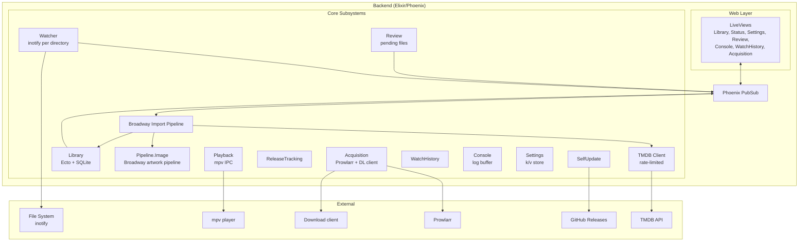
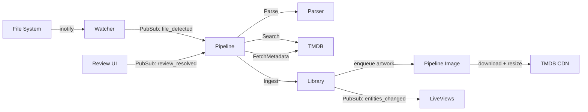

# Architecture

Media Centarr Backend is a Phoenix/Elixir application that watches directories for video files, enriches them with TMDB metadata and artwork, and serves the library through a LiveView web UI.

> **Architecture** · [Watcher](watcher.md) · [Pipeline](pipeline.md) · [TMDB](tmdb.md) · [Playback](playback.md) · [Library](library.md) · [Input System](input-system.md)

- [System Overview](#system-overview)
- [Bounded Contexts](#bounded-contexts)
- [Data Flow](#data-flow)
- [Supervision Tree](#supervision-tree)
- [PubSub Topics](#pubsub-topics)
- [Key Principles](#key-principles)
- [Specifications](#specifications)
- [Module Reference](#module-reference)

## System Overview

## Bounded Contexts

The backend is organised into eleven bounded contexts plus a TMDB adapter, all enforced at compile time by the [Boundary](https://hex.pm/packages/boundary) library. Read the `use Boundary` declaration at the top of each context's facade module for the canonical inter-context dependency list.

| Context | Owns | Notes |
|---------|------|-------|
| `MediaCentarr.Library` | `library_*` tables, entity facade, file presence | Type-specific schemas: Movie, TVSeries, MovieSeries, VideoObject, Season, Episode, Extra, Image, Identifier, WatchProgress, WatchedFile. |
| `MediaCentarr.Pipeline` | `pipeline_*` tables, Broadway import + image pipelines | Mediator that orchestrates parse → search → fetch → ingest. |
| `MediaCentarr.Review` | `review_*` table | Holds low-confidence matches awaiting human decision. |
| `MediaCentarr.Watcher` | inotify supervision, file presence, exclude-dir handling | No DB tables — in-memory file presence tracking. |
| `MediaCentarr.Settings` | `settings_*` table (key/value entries) | Shared infrastructure: any context may write its own keys via a declared `Settings` dep. |
| `MediaCentarr.ReleaseTracking` | `release_tracking_*` tables | Periodic TMDB refresh of upcoming items in the user's library. |
| `MediaCentarr.Playback` | mpv session supervision, progress broadcasts | No DB tables — in-memory sessions. |
| `MediaCentarr.Console` | `console_*` (filter/buffer-cap settings) + in-memory ring buffer + journal source | Drives the `/console` page and the Guake-style drawer. |
| `MediaCentarr.Acquisition` | `acquisition_*` tables, Prowlarr + download-client drivers, Oban jobs | Optional — gated by `MediaCentarr.Capabilities`. |
| `MediaCentarr.WatchHistory` | `watch_history_*` table | Append-only stream of playback events. |
| `MediaCentarr.SelfUpdate` | GitHub release polling, in-app updater | Disabled in dev. |
| `MediaCentarr.TMDB` | TMDB HTTP adapter + rate limiter | Cross-cutting adapter, not a bounded context owner. |
| `MediaCentarr.Capabilities` | Pure query layer over Settings | Predicates that gate features on a passing Test Connection. Reads `Settings`, owns no state. |
| `MediaCentarr.Controls` | Compile-time keybinding catalog + persisted overrides | Used by Settings → Controls UI. |

## Data Flow

## Supervision Tree

```mermaid
graph TD
    App[MediaCentarr.Supervisor<br/>one_for_one]

    App --> Telemetry[Telemetry]
    App --> Repo[Repo<br/>SQLite]
    App --> Oban[Oban]
    App --> PubSub[Phoenix.PubSub]
    App --> ConsoleBuffer[Console.Buffer]
    App --> JournalSource[Console.JournalSource]
    App --> TaskSup[TaskSupervisor]
    App --> RateLimiter[TMDB.RateLimiter]
    App --> WatcherSup[Watcher.Supervisor]
    App --> Availability[Library.Availability]
    App --> PipelineSup[Pipeline.Supervisor]
    App --> ImagePipelineSup[Pipeline.Image.Supervisor]
    App --> InitTask[Init Services Task]
    App --> FilePresence[Watcher.FilePresence]
    App --> FileEvents[Library.FileEventHandler]
    App --> SelfUpdater[SelfUpdate.Updater]
    App --> Listeners[PubSub listeners<br/>Inbound, Intake, Refresher,<br/>Recorder, Acquisition]
    App --> PlaybackSup[Playback.Supervisor]
    App --> Endpoint[Phoenix Endpoint]

    WatcherSup --> Registry[Watcher.Registry]
    WatcherSup --> DynSup[DynamicSupervisor]
    DynSup --> W1[Watcher per dir]

    ImagePipelineSup --> ImageStats[Pipeline.Image.Stats]
    ImagePipelineSup --> ImageRetry[Pipeline.Image.RetryScheduler]
    ImagePipelineSup --> ImageBroadway[Pipeline.Image<br/>Broadway]

    PlaybackSup --> SessionRegistry[SessionRegistry]
    PlaybackSup --> SessionSup[SessionSupervisor]
    SessionSup --> MpvSession[MpvSession per file]
```

PubSub listener GenServers (`Library.Inbound`, `Review.Intake`, `ReleaseTracking.Refresher`, `WatchHistory.Recorder`, `Acquisition`) are skipped in `:test` env — tests call the public functions directly. Watchers and the pipelines start in disabled state in tests; production toggles them via `services:<env>:start_watchers` / `start_pipeline` keys in `Settings`.

## PubSub Topics

`MediaCentarr.Topics` is the single source of truth for every topic string. Read [`lib/media_centarr/topics.ex`](../lib/media_centarr/topics.ex) instead of duplicating the list here. The current set, grouped by owner:

| Owner | Topics |
|-------|--------|
| Library | `library:updates`, `library:commands`, `library:file_events`, `library:watch_completed` |
| Pipeline | `pipeline:input`, `pipeline:matched`, `pipeline:images`, `pipeline:publish` |
| Watcher | `watcher:state` |
| Review | `review:intake`, `review:updates` |
| Playback | `playback:events` |
| Settings | `settings:updates`, `config:updates` |
| ReleaseTracking | `release_tracking:updates` |
| WatchHistory | `watch_history:events` |
| Console | `console:logs`, `service:journal` |
| Acquisition | `acquisition:updates` |
| Capabilities | `capabilities:updates` |
| SelfUpdate | `self_update:status`, `self_update:progress` |
| Controls | `controls:updates` |

Each context exposes a `subscribe/0` facade that wraps `Phoenix.PubSub.subscribe/2` with the right topic — LiveViews call `Library.subscribe()`, `Playback.subscribe()`, etc., never `Phoenix.PubSub.subscribe/2` directly. This is enforced by the `ContextSubscribeFacade` Credo check.

## Key Principles

- **Ecto is the data interface.** All persistence goes through context modules that wrap `Ecto.Repo` and broadcast `{:entities_changed, ids}` on `library:updates` for every mutation. Raw SQL is reserved for SQLite-specific features (e.g. `json_extract`).
- **Ecto schemas are the data spec.** Field names, types, and associations are defined in the schema modules under `lib/media_centarr/library/`. See [`specs/DATA-FORMAT.md`](../specs/DATA-FORMAT.md) for the entry shape returned to LiveViews.
- **UUIDs are permanent.** Entity IDs never change once assigned — they double as image directory names.
- **PubSub for cross-context communication.** Contexts don't call into each other's internals; cross-context wiring is enforced by Boundary.
- **Pipeline is a mediator.** The pipeline actively orchestrates — domain resources don't trigger pipeline behavior through state changes.
- **Capability gating.** UI surfaces that depend on TMDB / Prowlarr / the download client only appear once the integration's most recent Test Connection succeeded. See `MediaCentarr.Capabilities`.

## Specifications

Protocol specifications live in [`specs/`](../specs/):

| Spec | Governs |
|------|---------|
| [DATA-FORMAT.md](../specs/DATA-FORMAT.md) | Entity types, library entry shape, and pointer to the canonical Ecto schemas |
| [IMAGE-CACHING.md](../specs/IMAGE-CACHING.md) | Image storage conventions and the shared `MediaCentarr.Images` facade |

## Module Reference

| Module | Description | Path |
|--------|-------------|------|
| `MediaCentarr.Application` | OTP application, supervision tree | `lib/media_centarr/application.ex` |
| `MediaCentarr.Config` | TOML loader + DB-backed runtime overrides | `lib/media_centarr/config.ex` |
| `MediaCentarr.Topics` | Single source of truth for PubSub topic strings | `lib/media_centarr/topics.ex` |
| `MediaCentarr.Capabilities` | Predicates gating features on Test Connection results | `lib/media_centarr/capabilities.ex` |
| `MediaCentarr.Controls` | Keybinding catalog + persisted overrides | `lib/media_centarr/controls.ex` |
| `MediaCentarr.Images` | Shared image download + libvips resize service | `lib/media_centarr/images.ex` |
| `MediaCentarr.Log` | Component-tagged thinking-log macros | `lib/media_centarr/log.ex` |
| `MediaCentarr.Storage` | Disk usage measurement | `lib/media_centarr/storage.ex` |
| `MediaCentarr.Maintenance` | Operator-driven destructive operations (clear DB, refresh image cache, repair missing images) | `lib/media_centarr/maintenance.ex` |
