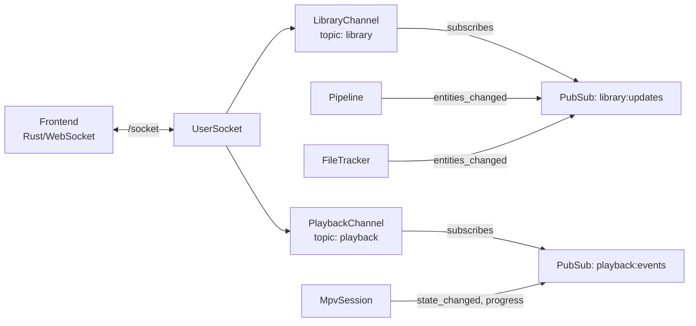

# Phoenix Channels

The backend serves the frontend over WebSocket at `/socket`. Two channels provide the real-time API: `library` for entity data and `playback` for player control.

> [Getting Started](getting-started.md) · [Configuration](configuration.md) · [Architecture](architecture.md) · [Watcher](watcher.md) · [Pipeline](pipeline.md) · [TMDB](tmdb.md) · [Playback](playback.md) · **Channels** · [Library](library.md)

- [Architecture](#architecture)
- [Key Concepts](#key-concepts)
- [LibraryChannel](#librarychannel)
- [PlaybackChannel](#playbackchannel)
- [Module Reference](#module-reference)

## Architecture



## Key Concepts

**No authentication.** This is a local-only application. All connections are accepted.

**Batch pushing.** Entity pushes are chunked into batches of 50 to prevent message size explosion during bulk operations.

**Server-push model.** LibraryChannel is read-only from the frontend's perspective — all data flows from server to client. PlaybackChannel accepts `play` commands.

## LibraryChannel

**Topic:** `library`

### Join

Returns `{:ok, %{}}`. Subscribes to `library:updates` PubSub topic. Triggers deferred full-library sync.

### Initial Sync

After join, the channel loads all entities with associations and progress, serializes them, and pushes in batches:

1. Push `library:entities` (batches of 50 entities)
2. Push `library:sync_complete` when done

### Entity Push Format

Each entity in `library:entities`:

```json
{
  "@id": "uuid",
  "entity": { /* Schema.org JSON-LD */ },
  "progress": { /* ProgressSummary or null */ },
  "resumeTarget": { /* ResumeTarget hint or null */ },
  "childTargets": { /* per-child hints or null */ }
}
```

### Live Updates

When entities change (PubSub `{:entities_changed, entity_ids}`):

1. Load updated entities
2. Compute which entities were removed (known but no longer loadable)
3. Push `library:entities_removed` with removed IDs (batched)
4. Push `library:entities` with updated entities (batched)
5. Update `known_entity_ids` MapSet

### Events Summary

| Event | Direction | Payload |
|-------|-----------|---------|
| `library:entities` | server → client | `%{entities: [entity_payload, ...]}` |
| `library:sync_complete` | server → client | `%{}` |
| `library:entities_removed` | server → client | `%{ids: [uuid, ...]}` |

## PlaybackChannel

**Topic:** `playback`

### Join

Returns `{:ok, state, socket}` where `state` is the current playback state:

```json
{
  "state": "idle",
  "now_playing": null
}
```

Subscribes to `playback:events` PubSub topic.

### Incoming Events

**`play`** — Start playback for an entity

Request:
```json
{ "entity_id": "uuid" }
```

Reply (success):
```json
{
  "action": "resume",
  "entity_id": "uuid",
  "season_number": 1,
  "episode_number": 3,
  "position_seconds": 542.3
}
```

Reply (error):
```json
{ "reason": "not_found" }
```

### Outgoing Events

**`playback:state_changed`** — Player state transition

```json
{
  "state": "playing",
  "now_playing": {
    "entity_id": "uuid",
    "entity_name": "Movie Title",
    "season_number": null,
    "episode_number": null,
    "episode_name": null,
    "content_url": "/path/to/file.mkv",
    "position_seconds": 42.5,
    "duration_seconds": 7200.0
  }
}
```

States: `idle`, `playing`, `paused`, `stopped`

**`playback:entity_progress_updated`** — Progress save during playback

```json
{
  "entity_id": "uuid",
  "progress": {
    "current_episode": { "season": 1, "episode": 3 },
    "episode_position_seconds": 542.3,
    "episode_duration_seconds": 2400.0,
    "episodes_completed": 5,
    "episodes_total": 24
  },
  "resumeTarget": { "action": "resume", "targetId": "uuid", ... },
  "childTargets": { "episode-uuid": { "action": "resume", ... } }
}
```

### Events Summary

| Event | Direction | Payload |
|-------|-----------|---------|
| `play` | client → server | `%{entity_id: uuid}` |
| `playback:state_changed` | server → client | `%{state, now_playing}` |
| `playback:entity_progress_updated` | server → client | `%{entity_id, progress, resumeTarget, childTargets}` |

## Module Reference

| Module | Description | Path |
|--------|-------------|------|
| `MediaCentaurWeb.UserSocket` | WebSocket endpoint, topic routing | `lib/media_centaur_web/channels/user_socket.ex` |
| `MediaCentaurWeb.LibraryChannel` | Library data sync and updates | `lib/media_centaur_web/channels/library_channel.ex` |
| `MediaCentaurWeb.PlaybackChannel` | Playback commands and state | `lib/media_centaur_web/channels/playback_channel.ex` |
