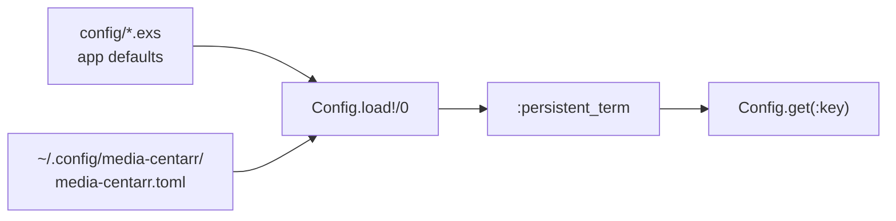

# Configuration

All configuration is loaded from a single TOML file at startup. No runtime reload — restart the application to apply changes.

> [Getting Started](getting-started.md) · **Configuration** · [Architecture](architecture.md) · [Watcher](watcher.md) · [Pipeline](pipeline.md) · [TMDB](tmdb.md) · [Playback](playback.md) · [Library](library.md)

- [Config File Location](#config-file-location)
- [Loading Order](#loading-order)
- [Config Keys](#config-keys)
- [Watch Directories](#watch-directories)
- [Full Defaults](#full-defaults)
- [Module Reference](#module-reference)

## Config File Location

```
~/.config/media-centarr/media-centarr.toml
```

If this file is missing, the application falls back to built-in defaults. If the file exists but has invalid TOML syntax, a warning is logged and defaults are used.

A complete template ships in the repo at `defaults/media-centarr.toml`.

## Loading Order



1. Application environment defaults (from `config/*.exs`)
2. User TOML file at `~/.config/media-centarr/media-centarr.toml` (overrides defaults)
3. Values stored in `:persistent_term` for fast read-only access

## Config Keys

| Key | Type | Default | Description |
|-----|------|---------|-------------|
| `database_path` | string | `~/.local/share/media-centarr/media-centarr.db` | SQLite database file path |
| `watch_dirs` | array | `[]` | Directories to watch for video files |
| `exclude_dirs` | array | `[]` | Directories to skip during watching |
| `file_absence_ttl_days` | integer | `30` | Days to retain records for files on disconnected drives |
| `tmdb.api_key` | string | `""` | TMDB API key (required for metadata) |
| `pipeline.auto_approve_threshold` | float | `0.85` | Confidence score threshold for auto-approval |
| `pipeline.extras_dirs` | array | see defaults | Directory names treated as bonus features |
| `playback.mpv_path` | string | `/usr/bin/mpv` | Path to mpv binary |
| `playback.socket_dir` | string | `/tmp` | Directory for MPV IPC sockets |
| `playback.socket_timeout_ms` | integer | `5000` | MPV socket connection timeout |

## Watch Directories

Three formats are supported:

```toml
# Plain string — uses default images directory
watch_dirs = ["/mnt/media"]

# Inline table — custom images directory per entry
watch_dirs = [
  { dir = "/mnt/media", images_dir = "/mnt/media/.cache/images" },
  { dir = "/mnt/videos" }
]

# Legacy single directory (converted to watch_dirs internally)
media_dir = "/mnt/media"
```

Default images directory for each watch dir: `{dir}/.media-centarr/images`

All paths support `~` expansion.

## Full Defaults

The complete `defaults/media-centarr.toml` shipped with the repo:

```toml
# defaults/media-centarr.toml
#
# Shipped default configuration for Media Centarr — Backend.
# Copy this file to ~/.config/media-centarr/media-centarr.toml and edit as needed.
# This file must contain every recognised config key; keep it up to date as new
# keys are added to MediaCentarr.Config.

# Path to the SQLite database file.
database_path = "~/.local/share/media-centarr/media-centarr.db"

# Directories containing video/media files (e.g. torrent downloads folders).
# Watched for additions and removals. May be on removable or network drives.
# Add multiple directories to watch media across several drives/mounts.
#
# Each watch directory can specify its own images_dir for artwork caching.
# If omitted, defaults to {dir}/.media-centarr/images.
# Examples:
#   watch_dirs = [{ dir = "/mnt/media", images_dir = "/mnt/media/.cache/images" }]
#   watch_dirs = [{ dir = "/mnt/media" }]   # uses default images_dir
#   watch_dirs = ["/mnt/media"]              # plain string, uses default images_dir
watch_dirs = [
  { dir = "/mnt/videos/Videos" },
]

# Directories to exclude from watching. Files inside these directories
# (and their subdirectories) are ignored by both inotify and manual scans.
# Paths are expanded (~ resolved). Must be absolute paths.
exclude_dirs = []

# Number of days to retain database records for files on disconnected/unmounted
# drives before cleaning them up. Files that are explicitly deleted are cleaned
# up immediately regardless of this setting.
file_absence_ttl_days = 30

[tmdb]
# TMDB API key. Required for metadata scraping. Get one at https://www.themoviedb.org/settings/api
api_key = ""

[pipeline]
# Confidence score threshold (0.0–1.0). Matches at or above this score are
# written automatically. Below it, the item is queued for human review.
auto_approve_threshold = 0.85

# Directory names (case-insensitive) treated as bonus-feature containers.
# Files inside these directories are linked to the parent movie as extras.
extras_dirs = ["Extras", "Featurettes", "Special Features", "Behind The Scenes", "Bonus", "Deleted Scenes"]

[playback]
# Absolute path to the mpv binary.
mpv_path = "/usr/bin/mpv"
# Directory for MPV IPC sockets. Must be writable.
socket_dir = "/tmp"
# Timeout in ms for connecting to the MPV IPC socket after launch.
socket_timeout_ms = 5000
```

## Module Reference

| Module | Description | Path |
|--------|-------------|------|
| `MediaCentarr.Config` | TOML loader, `:persistent_term` storage, path helpers | `lib/media_centarr/config.ex` |
