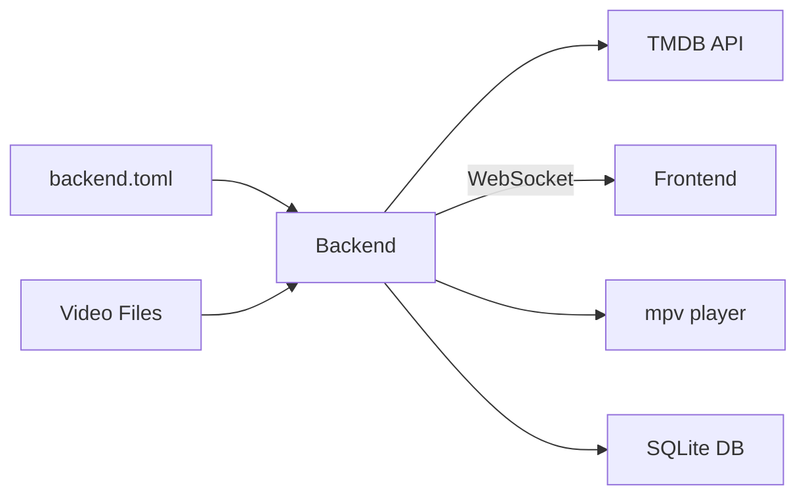

# Getting Started

Media Centaur Backend is a Phoenix/Elixir application that manages a media library — watching directories for video files, scraping metadata from TMDB, downloading artwork, and serving everything to the frontend over WebSocket.

> **Getting Started** · [Configuration](configuration.md) · [Architecture](architecture.md) · [Watcher](watcher.md) · [Pipeline](pipeline.md) · [TMDB](tmdb.md) · [Playback](playback.md) · [Channels](channel.md) · [Library](library.md)

- [System Requirements](#system-requirements)
- [Install](#install)
- [Configure](#configure)
- [Run](#run)
- [Test](#test)
- [Compilation](#compilation)
- [Release](#release)
- [System Overview](#system-overview)
- [Next Steps](#next-steps)

## System Requirements

| Dependency | Version | Notes |
|------------|---------|-------|
| Erlang/OTP | 26+ | Required by Elixir 1.15+ |
| Elixir | ~> 1.15 | See `mix.exs` for exact constraint |
| SQLite3 | 3.x | Database engine (via `ash_sqlite`) |
| mpv | any | Video playback (path configurable) |
| inotify-tools | any | File system watching (Linux kernel support) |

## Install

```bash
git clone https://github.com/user/media-centaur.git
cd media-centaur/backend
mix setup    # install deps, create DB, run migrations, build assets
```

`mix setup` expands to:

```bash
mix deps.get
mix ecto.create
mix ecto.migrate
mix run priv/repo/seeds.exs
mix tailwind.install --if-missing
mix esbuild.install --if-missing
mix compile
mix tailwind media_centaur
mix esbuild media_centaur
```

## Configure

Copy the default config and edit:

```bash
mkdir -p ~/.config/media-centaur
cp defaults/backend.toml ~/.config/media-centaur/backend.toml
```

At minimum, set your TMDB API key and watch directories:

```toml
watch_dirs = [
  { dir = "/path/to/your/videos" },
]

[tmdb]
api_key = "your-tmdb-api-key"
```

Get a TMDB API key at <https://www.themoviedb.org/settings/api>.

See [configuration.md](configuration.md) for all options.

## Run

```bash
mix phx.server    # start dev server at http://localhost:4000
```

The admin UI is at `http://localhost:4000`. The frontend connects via WebSocket at `/socket`.

## Test

```bash
mix test           # run all tests (creates and migrates test DB automatically)
mix precommit      # compile --warning-as-errors, unlock unused deps, format, test
```

## Compilation

Speed up native dependency compilation with:

```bash
MIX_OS_DEPS_COMPILE_PARTITION_COUNT=8 mix compile
```

## Release

Build and install with the provided scripts:

```bash
scripts/release              # build production release (add --clean to wipe _build/prod first)
scripts/install              # install to ~/.local/lib/media-centaur/ and set up systemd
```

`scripts/install` copies the release, installs a patched systemd unit, runs migrations, and restarts the service if it was already active.

### Manual build

If you prefer to build manually:

```bash
MIX_ENV=prod mix assets.deploy
MIX_ENV=prod mix release
```

The release is written to `_build/prod/rel/media_centaur/`.

### Run the release

```bash
bin/media_centaur start       # foreground
bin/media_centaur daemon       # background
bin/media_centaur stop         # stop a running daemon
bin/media_centaur remote       # IEx shell attached to running node
```

The release binds to `127.0.0.1:4000` and enables `server: true` automatically — no environment variables needed.

### Run migrations

```bash
bin/media_centaur eval "MediaCentaur.Release.migrate()"
```

### systemd user unit

`scripts/install` handles systemd setup automatically. To set up manually instead:

A template unit file ships at `defaults/media-centaur-backend.service`. To install:

```bash
mkdir -p ~/.config/systemd/user
cp defaults/media-centaur-backend.service ~/.config/systemd/user/media-centaur-backend.service
```

Edit `ExecStart` and `ExecStop` to point to your release `bin/media_centaur`, then:

```bash
systemctl --user daemon-reload
systemctl --user enable --now media-centaur-backend
journalctl --user -u media-centaur-backend -f    # view logs
```

### Release tuning

`rel/env.sh.eex` configures the BEAM for desktop daemon use:

- **`sname`** distribution — simpler than full names for a local-only node
- **`+sbwt none`** — disables scheduler busy-waiting, reducing idle CPU usage

## System Overview



## Next Steps

- [Configuration](configuration.md) — all config options with defaults
- [Architecture](architecture.md) — system overview and component relationships
- [Pipeline](pipeline.md) — how files are processed
