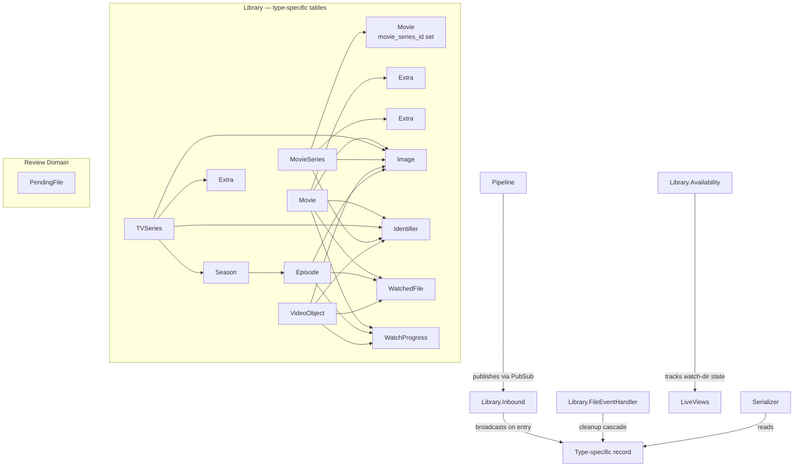
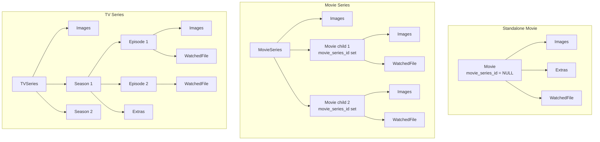

# Library

The library is the core data domain. It stores all media entities, their relationships, watch progress, and file tracking. Built on [Ecto](https://github.com/elixir-ecto/ecto) with SQLite, organized as type-specific schemas (Movie, TVSeries, MovieSeries, VideoObject) wrapped by the `MediaCentarr.Library` context module.

> [Architecture](architecture.md) · [Watcher](watcher.md) · [Pipeline](pipeline.md) · [TMDB](tmdb.md) · [Playback](playback.md) · **Library** · [Input System](input-system.md)

- [Architecture](#architecture)
- [Key Concepts](#key-concepts)
- [Entity Hierarchy](#entity-hierarchy)
- [Resources](#resources)
- [Inbound API](#inbound-api)
- [File Tracking](#file-tracking)
- [Availability](#availability)
- [Deletion](#deletion)
- [Review Domain](#review-domain)
- [Module Reference](#module-reference)

## Architecture

The library uses **type-specific tables** instead of a single polymorphic Entity table. Each media type is its own first-class Ecto schema (Movie, TVSeries, MovieSeries, VideoObject) with its own table, associations, and UUID identity. Images, identifiers, extras, and watch progress hang off the type-specific record via type-specific FKs (`movie_id`, `tv_series_id`, `movie_series_id`, `video_object_id`).

## Key Concepts

**Entity tables:**

| Type | Table | Schema | Children |
|------|-------|--------|----------|
| Movie | `library_movies` (`movie_series_id` NULL = standalone) | `Library.Movie` | Extras |
| TV Series | `library_tv_series` | `Library.TVSeries` | Seasons → Episodes, Extras |
| Movie Series | `library_movie_series` | `Library.MovieSeries` | Movies (children), Extras |
| Video Object | `library_video_objects` | `Library.VideoObject` | — |

The `Movie` schema serves both standalone movies and MovieSeries children. The `movie_series_id` column distinguishes them.

> The old `library_entities` table was dropped on 2026-04-03 (migration `20260403000002_drop_entity_table.exs`). Type-specific tables are the only data path. `library_entity_id` columns survive in unrelated tables (release_tracking, etc.) as references to type-specific UUIDs that were preserved across the data migration — legacy-named columns, correct values.

**One image per role per owner.** Roles: `poster`, `backdrop`, `logo`, `thumb`. Enforced by per-owner-type unique indexes on `(<owner_id>, role)`.

**External identifiers.** The `ExternalId` resource links each type record to TMDB IDs (and potentially IMDB, TVDB in the future). Stored as `{source, external_id}` per row.

**File tracking.** `WatchedFile` links a video file path to its specific type record via the appropriate FK. Tracks presence state (`:complete` or `:absent`) for removable drive support.

## Entity Hierarchy

## Resources

### Movie / TVSeries / MovieSeries / VideoObject

The four top-level type records. Each carries common attributes — `name`, `description`, `date_published`, `genres`, `duration`, `director`, `content_rating` — plus type-specific fields (e.g. `number_of_seasons` on `TVSeries`, `position` on a Movie linked to a MovieSeries, `content_url` on Movie / Episode / VideoObject for the playable file path). The Ecto schemas in `lib/media_centarr/library/` are the canonical reference.

CRUD goes through `MediaCentarr.Library` (the context facade) using ordinary Ecto queries — no Ash actions or polymorphic dispatch. Reads that need full association trees use the dedicated helper modules listed in the [Module Reference](#module-reference).

### Season

TV season. One per entity per season number.

**Key attributes:** `season_number`, `number_of_episodes`, `name`

### Episode

TV episode within a season. Stores per-episode `content_url`.

**Key attributes:** `episode_number`, `name`, `description`, `duration`, `content_url`

### Movie (child)

Movie within a movie series. Stores per-movie `content_url` and `position` in the series.

**Key attributes:** `name`, `description`, `date_published`, `duration`, `director`, `content_url`, `tmdb_id`, `position`

### Extra

Bonus feature (featurette, behind-the-scenes, deleted scene). Belongs to entity or season.

**Key attributes:** `name`, `content_url`, `position`

### Image

Artwork file. One per role per owner (entity, movie, or episode).

**Key attributes:** `role`, `url` (TMDB source), `content_url` (local relative path), `extension`

**Roles:** `poster`, `backdrop`, `logo`, `thumb`

### Identifier

External service ID linking a type record to TMDB, IMDB, etc. Stored in `library_identifiers` with type-specific FKs.

**Key attributes:** `source` (e.g., `"tmdb"`, `"tmdb_collection"`), `external_id`

### WatchedFile

Links a video file on disk to its entity. Tracks file presence for removable drives.

**Key attributes:** `file_path`, `state` (`:complete` / `:absent`), `watch_dir`, `absent_since`

### WatchProgress

Per-playable-item progress. Indexed by `(entity_id, season_number, episode_number)`.

**Key attributes:** `season_number`, `episode_number`, `position_seconds`, `duration_seconds`, `completed`, `last_watched_at`

For standalone movies: `season_number = 0, episode_number = 0`. For movie series children: `season_number = 0, episode_number = ordinal`.

> Settings (the per-installation key/value store) is its own bounded context — `MediaCentarr.Settings.Entry` — not part of `Library`. See [`architecture.md`](architecture.md#bounded-contexts).

## Inbound API

`MediaCentarr.Library.Inbound` is the pipeline's entry point into the library. It is a PubSub-listener GenServer (subscribed to `pipeline:publish`) that handles `{:entity_published, event}` and `{:image_ready, attrs}` messages and:

1. **Resolves** existing type records by TMDB identifier lookup via `Library.Identifier`
2. **Creates** new records (and their children) if not found, with race-loss recovery on the unique `(source, external_id)` constraint
3. **Links** to existing records if found — adds new seasons, episodes, MovieSeries children, extras
4. **Moves** staged images from the staging directory to the final `images_dir/<record_id>/role.ext`

The pipeline never calls `Library.Inbound` directly; everything flows through PubSub.

## File Tracking

`Library.FileEventHandler` (GenServer) subscribes to PubSub for file events:

**Immediate cleanup** (file deleted):
1. Delete WatchedFile records
2. Delete child records (episodes, movies, extras) matching removed paths
3. Delete empty seasons
4. Delete orphaned top-level records (no remaining WatchedFiles)
5. Delete cached image files

**Deferred cleanup** (drive unavailable):
1. Mark WatchedFiles as `:absent` with timestamp
2. Periodic TTL check (every 24 hours)
3. After `file_absence_ttl_days`, run full cleanup

## Availability

`Library.Availability` is a top-level GenServer that tracks per-watch-directory mount/reachability state. It exposes `available?/1` so UI code (and the LiveView templates that drive cards and the detail panel) can replace the **Play** button with a muted **Offline** indicator when a file's underlying drive is unmounted or unreachable.

This is the v0.20.0 fix for the silent-failure mode where pressing Play on an unmounted file did nothing.

## Deletion

`Library.Removal` provides UI-initiated file and folder deletion from the detail modal's info page.

**Per-file deletion:**
1. `File.rm(path)` — `:enoent` (already absent) treated as success
2. `FileEventHandler.cleanup_removed_files([path])` — removes WatchedFile, child records (episode/movie/extra matched by `content_url`), cascades record deletion if orphaned
3. Broadcasts `{:entities_changed, entity_ids}`

**Folder deletion:**
1. Pre-collect all WatchedFile paths under the folder (prefix match) — critical because `rm -rf` does not generate per-file inotify events
2. `File.rm_rf(folder_path)` — removes entire directory tree
3. `FileEventHandler.cleanup_removed_files(collected_paths)` — explicit cleanup with pre-collected paths
4. Broadcasts `{:entities_changed, entity_ids}`

**Cascade deletion:** When the last file for a top-level record is removed, `EntityCascade.destroy!/1` runs the FK-safe deletion order: watch progress → extras → episodes → seasons → movies → images → image directories → identifiers → top-level record.

**Watcher race condition:** `cleanup_removed_files/1` is idempotent — if the watcher also detects the deletion (for single-file deletes via inotify), it calls the same function. The second cleanup finds no WatchedFile records and returns `[]` (no-op). The watcher's 3-second debounce means the UI's explicit cleanup always completes first.

**Playback guard:** Deletion is blocked if the entity has an active playback session. The UI shows an error flash instead of the confirmation dialog.

## Review Domain

Separate bounded context (`MediaCentarr.Review`) for files awaiting human review.

**PendingFile** stores: file path, parsed metadata, best TMDB match with confidence, all scored candidates, status (`:pending` / `:approved` / `:dismissed`).

**Review.Intake** maps pipeline payloads into PendingFile records.

See [pipeline.md](pipeline.md#review-flow) for the full review workflow.

## Module Reference

| Module | Description | Path |
|--------|-------------|------|
| `MediaCentarr.Library` | Library context — CRUD for all types | `lib/media_centarr/library.ex` |
| `MediaCentarr.Library.Movie` | Standalone or collection movie | `lib/media_centarr/library/movie.ex` |
| `MediaCentarr.Library.TVSeries` | TV series with seasons/episodes | `lib/media_centarr/library/tv_series.ex` |
| `MediaCentarr.Library.MovieSeries` | Movie collection/saga | `lib/media_centarr/library/movie_series.ex` |
| `MediaCentarr.Library.VideoObject` | Standalone video | `lib/media_centarr/library/video_object.ex` |
| `MediaCentarr.Library.Season` | TV season | `lib/media_centarr/library/season.ex` |
| `MediaCentarr.Library.Episode` | TV episode | `lib/media_centarr/library/episode.ex` |
| `MediaCentarr.Library.Extra` | Bonus feature | `lib/media_centarr/library/extra.ex` |
| `MediaCentarr.Library.Image` | Artwork | `lib/media_centarr/library/image.ex` |
| `MediaCentarr.Library.ExternalId` | Identifier (TMDB, IMDB) — schema for `library_identifiers` | `lib/media_centarr/library/external_id.ex` |
| `MediaCentarr.Library.WatchedFile` | File-to-record link | `lib/media_centarr/library/watched_file.ex` |
| `MediaCentarr.Library.WatchProgress` | Playback progress | `lib/media_centarr/library/watch_progress.ex` |
| `MediaCentarr.Library.TypeResolver` | UUID-to-type-record lookup | `lib/media_centarr/library/type_resolver.ex` |
| `MediaCentarr.Library.EntityShape` | Normalize type records to common map shape | `lib/media_centarr/library/entity_shape.ex` |
| `MediaCentarr.Library.EntityCascade` | Cascade-deletion order | `lib/media_centarr/library/entity_cascade.ex` |
| `MediaCentarr.Library.Inbound` | Pipeline → library inbound PubSub listener | `lib/media_centarr/library/inbound.ex` |
| `MediaCentarr.Library.Availability` | Per-watch-dir mount/reachability tracker | `lib/media_centarr/library/availability.ex` |
| `MediaCentarr.Library.Browser` | Library browse + filter helpers used by LibraryLive | `lib/media_centarr/library/browser.ex` |
| `MediaCentarr.Library.ProgressTracker` | Resume-target / completion bookkeeping | `lib/media_centarr/library/progress_tracker.ex` |
| `MediaCentarr.Library.LastActivity` | "Recently watched" / activity ordering helper | `lib/media_centarr/library/last_activity.ex` |
| `MediaCentarr.Library.Helpers` | PubSub broadcast helpers | `lib/media_centarr/library/helpers.ex` |
| `MediaCentarr.Library.FileEventHandler` | File presence tracking, cleanup | `lib/media_centarr/library/file_event_handler.ex` |
| `MediaCentarr.Library.ChangeLog` | Library change recording | `lib/media_centarr/library/change_log.ex` |
| `MediaCentarr.Review` | Review context | `lib/media_centarr/review.ex` |
| `MediaCentarr.Review.PendingFile` | Pending review file | `lib/media_centarr/review/pending_file.ex` |
| `MediaCentarr.Review.Intake` | Payload → PendingFile mapper | `lib/media_centarr/review/intake.ex` |
