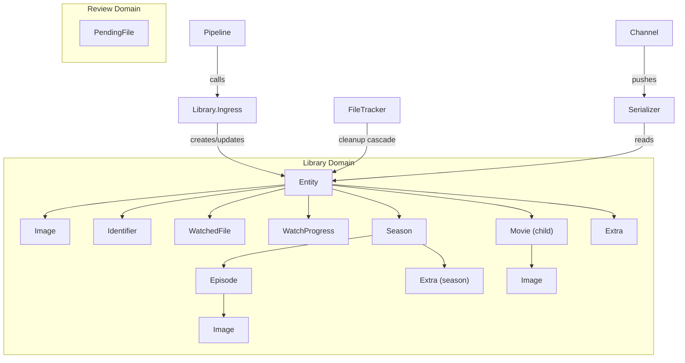
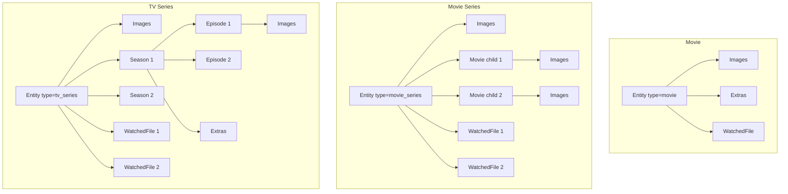

# Library

The library is the core data domain. It stores all media entities, their relationships, watch progress, and file tracking. Built entirely on [Ash Framework](https://ash-hq.org/) with SQLite.

> [Getting Started](getting-started.md) · [Configuration](configuration.md) · [Architecture](architecture.md) · [Watcher](watcher.md) · [Pipeline](pipeline.md) · [TMDB](tmdb.md) · [Playback](playback.md) · **Library**

- [Architecture](#architecture)
- [Key Concepts](#key-concepts)
- [Entity Hierarchy](#entity-hierarchy)
- [Resources](#resources)
- [Ingress API](#ingress-api)
- [File Tracking](#file-tracking)
- [Deletion](#deletion)
- [Review Domain](#review-domain)
- [Module Reference](#module-reference)

## Architecture

## Key Concepts

**Entity types:**

| Type | Schema.org | Description |
|------|------------|-------------|
| `:movie` | Movie | Standalone movie |
| `:movie_series` | MovieSeries | Collection of related movies |
| `:tv_series` | TVSeries | TV show with seasons and episodes |
| `:video_object` | VideoObject | Generic video (fallback) |

**One image per role per owner.** Roles: `poster`, `backdrop`, `logo`, `thumb`. Enforced by unique identities.

**External identifiers.** The `Identifier` resource links entities to TMDB IDs (and potentially IMDB, TVDB in the future). Modeled as schema.org `PropertyValue`.

**File tracking.** `WatchedFile` links a video file path to its resolved entity. Tracks presence state (`:complete` or `:absent`) for removable drive support.

## Entity Hierarchy

## Resources

### Entity

Root media object. All other resources belong to an entity.

**Key attributes:** `type`, `name`, `description`, `date_published`, `genres`, `content_url` (standalone movies only), `duration`, `director`, `content_rating`, `number_of_seasons`, `aggregate_rating_value`

**Key actions:**
- `:create` — create from pipeline metadata
- `:with_associations` — load full relationship tree
- `:with_progress` — load progress and season/episode structure
- `:set_content_url` — update video file path

### Season

TV season. One per entity per season number.

**Key attributes:** `season_number`, `number_of_episodes`, `name`

### Episode

TV episode within a season. Stores per-episode `content_url`.

**Key attributes:** `episode_number`, `name`, `description`, `duration`, `content_url`

### Movie (child)

Movie within a movie series. Stores per-movie `content_url` and `position` in the series.

**Key attributes:** `name`, `description`, `date_published`, `duration`, `director`, `content_url`, `tmdb_id`, `position`

### Extra

Bonus feature (featurette, behind-the-scenes, deleted scene). Belongs to entity or season.

**Key attributes:** `name`, `content_url`, `position`

### Image

Artwork file. One per role per owner (entity, movie, or episode).

**Key attributes:** `role`, `url` (TMDB source), `content_url` (local relative path), `extension`

**Roles:** `poster`, `backdrop`, `logo`, `thumb`

### Identifier

External service ID linking entity to TMDB, IMDB, etc.

**Key attributes:** `property_id` (e.g., `"tmdb"`, `"tmdb_collection"`), `value`

### WatchedFile

Links a video file on disk to its entity. Tracks file presence for removable drives.

**Key attributes:** `file_path`, `state` (`:complete` / `:absent`), `watch_dir`, `absent_since`

### WatchProgress

Per-playable-item progress. Indexed by `(entity_id, season_number, episode_number)`.

**Key attributes:** `season_number`, `episode_number`, `position_seconds`, `duration_seconds`, `completed`, `last_watched_at`

For standalone movies: `season_number = 0, episode_number = 0`. For movie series children: `season_number = 0, episode_number = ordinal`.

### Setting

Key/value store persisted in SQLite. Used for logging component toggles.

**Key attributes:** `key`, `value` (map)

## Ingress API

`Library.Ingress.ingest/1` is the pipeline's entry point into the library. It:

1. **Resolves** existing entity by TMDB identifier lookup
2. **Creates** new entity with children if not found (with race-loss recovery)
3. **Links** to existing entity if found (adds new seasons, episodes, movies, extras)
4. **Moves** staged images from temp directory to final `images_dir/entity_id/role.ext`

Returns `{:ok, entity, :new | :new_child | :existing}` or `{:error, reason}`.

## File Tracking

`Library.FileTracker` (GenServer) subscribes to PubSub for file events:

**Immediate cleanup** (file deleted):
1. Delete WatchedFile records
2. Delete child records (episodes, movies, extras) matching removed paths
3. Delete empty seasons
4. Delete orphaned entities (no remaining WatchedFiles)
5. Delete cached image files

**Deferred cleanup** (drive unavailable):
1. Mark WatchedFiles as `:absent` with timestamp
2. Periodic TTL check (every 24 hours)
3. After `file_absence_ttl_days`, run full cleanup

## Deletion

`Library.Removal` provides UI-initiated file and folder deletion from the detail modal's info page.

**Per-file deletion:**
1. `File.rm(path)` — `:enoent` (already absent) treated as success
2. `FileTracker.cleanup_removed_files([path])` — removes WatchedFile, child records (episode/movie/extra matched by `content_url`), cascades entity deletion if orphaned
3. Broadcasts `{:entities_changed, entity_ids}`

**Folder deletion:**
1. Pre-collect all WatchedFile paths under the folder (prefix match) — critical because `rm -rf` does not generate per-file inotify events
2. `File.rm_rf(folder_path)` — removes entire directory tree
3. `FileTracker.cleanup_removed_files(collected_paths)` — explicit cleanup with pre-collected paths
4. Broadcasts `{:entities_changed, entity_ids}`

**Cascade deletion:** When the last file for an entity is removed, `EntityCascade.destroy!/1` runs the FK-safe deletion order: watch progress → extras → episodes → seasons → movies → images → image directories → identifiers → entity.

**Watcher race condition:** `cleanup_removed_files/1` is idempotent — if the watcher also detects the deletion (for single-file deletes via inotify), it calls the same function. The second cleanup finds no WatchedFile records and returns `[]` (no-op). The watcher's 3-second debounce means the UI's explicit cleanup always completes first.

**Playback guard:** Deletion is blocked if the entity has an active playback session. The UI shows an error flash instead of the confirmation dialog.

## Review Domain

Separate Ash domain for files awaiting human review.

**PendingFile** stores: file path, parsed metadata, best TMDB match with confidence, all scored candidates, status (`:pending` / `:approved` / `:dismissed`).

**Review.Intake** maps pipeline payloads into PendingFile records.

See [pipeline.md](pipeline.md#review-flow) for the full review workflow.

## Module Reference

| Module | Description | Path |
|--------|-------------|------|
| `MediaCentaur.Library` | Ash domain declaration | `lib/media_centaur/library.ex` |
| `MediaCentaur.Library.Entity` | Root entity resource | `lib/media_centaur/library/entity.ex` |
| `MediaCentaur.Library.Season` | TV season resource | `lib/media_centaur/library/season.ex` |
| `MediaCentaur.Library.Episode` | TV episode resource | `lib/media_centaur/library/episode.ex` |
| `MediaCentaur.Library.Movie` | Child movie resource | `lib/media_centaur/library/movie.ex` |
| `MediaCentaur.Library.Extra` | Bonus feature resource | `lib/media_centaur/library/extra.ex` |
| `MediaCentaur.Library.Image` | Artwork resource | `lib/media_centaur/library/image.ex` |
| `MediaCentaur.Library.Identifier` | External ID resource | `lib/media_centaur/library/identifier.ex` |
| `MediaCentaur.Library.WatchedFile` | File tracking resource | `lib/media_centaur/library/watched_file.ex` |
| `MediaCentaur.Library.WatchProgress` | Playback progress resource | `lib/media_centaur/library/watch_progress.ex` |
| `MediaCentaur.Library.Setting` | Key/value settings resource | `lib/media_centaur/library/setting.ex` |
| `MediaCentaur.Library.Ingress` | Pipeline → library inbound API | `lib/media_centaur/library/ingress.ex` |
| `MediaCentaur.Library.Helpers` | Entity loading, PubSub broadcast | `lib/media_centaur/library/helpers.ex` |
| `MediaCentaur.Library.FileTracker` | File presence tracking, cleanup | `lib/media_centaur/library/file_tracker.ex` |
| `MediaCentaur.Library.Removal` | UI-initiated file/folder deletion | `lib/media_centaur/library/removal.ex` |
| `MediaCentaur.Review` | Review Ash domain | `lib/media_centaur/review.ex` |
| `MediaCentaur.Review.PendingFile` | Pending review resource | `lib/media_centaur/review/pending_file.ex` |
| `MediaCentaur.Review.Intake` | Payload → PendingFile mapper | `lib/media_centaur/review/intake.ex` |
