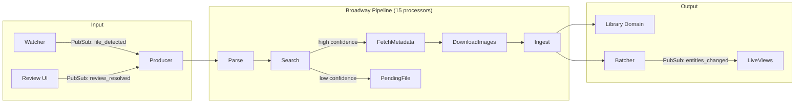
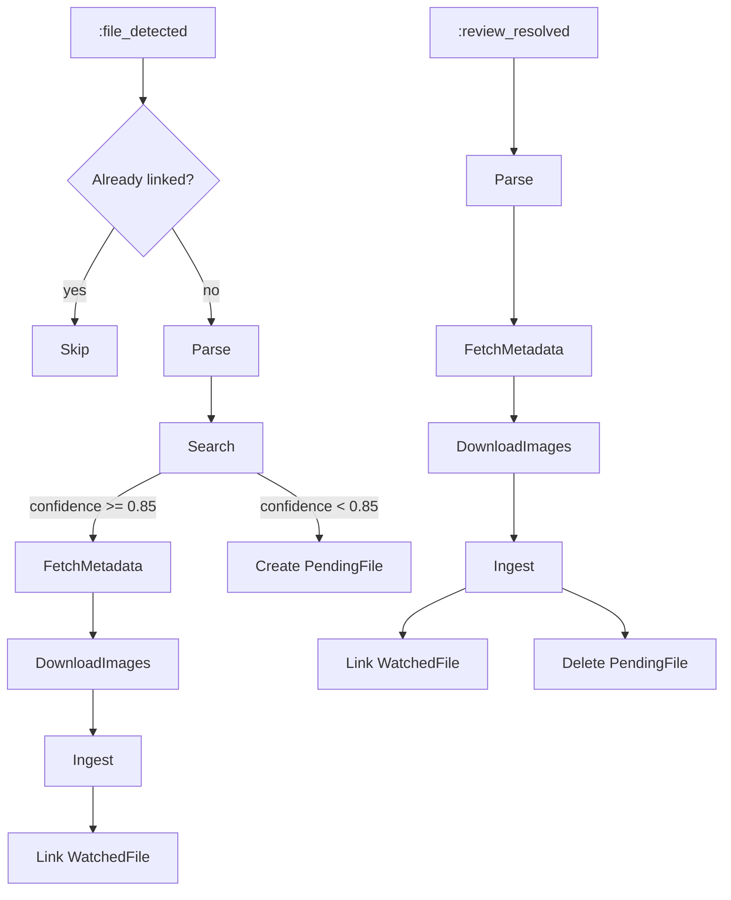

# Pipeline

The pipeline processes detected video files through metadata enrichment and library ingestion. Built on [Broadway](https://github.com/dashbitco/broadway), it runs 15 concurrent processors partitioned by file path.

> [Getting Started](getting-started.md) · [Configuration](configuration.md) · [Architecture](architecture.md) · [Watcher](watcher.md) · **Pipeline** · [TMDB](tmdb.md) · [Playback](playback.md) · [Library](library.md)

- [Architecture](#architecture)
- [Key Concepts](#key-concepts)
- [Pipeline Stages](#pipeline-stages)
- [Batching](#batching)
- [Idempotency](#idempotency)
- [Telemetry & Stats](#telemetry--stats)
- [Review Flow](#review-flow)
- [Extras (Bonus Features)](#extras-bonus-features)
- [Module Reference](#module-reference)

## Architecture

## Key Concepts

**Payload:** `%Pipeline.Payload{}` carries all intermediate state through stages. Each stage reads specific fields and writes new ones:

| Field | Set By | Type |
|-------|--------|------|
| `file_path` | Producer | string |
| `watch_directory` | Producer | string |
| `entry_point` | Producer | `:file_detected` or `:review_resolved` |
| `parsed` | Parse | `%Parser.Result{}` |
| `tmdb_id` | Search (or Producer for review) | integer |
| `tmdb_type` | Search (or Producer for review) | `:movie` or `:tv` |
| `confidence` | Search | float (0.0–1.0) |
| `metadata` | FetchMetadata | map (entity attrs, images, identifiers) |
| `staged_images` | DownloadImages | list of `%{role, owner, local_path}` |
| `entity_id` | Ingest | UUID |

**Two entry points:**

## Pipeline Stages

### Parse

Extracts title, year, type, season, and episode from the file path using `MediaCentarr.Parser`. Always succeeds — unparseable paths return type `:unknown`.

### Search

Searches TMDB for the parsed title using `TMDB.Client`, then scores results with `TMDB.Confidence`:

- Known type (movie/tv) — single search
- Unknown type — dual async search (movie + tv), best score wins
- Extras with season — TV search; without season — movie search
- Returns `{:needs_review, payload}` if confidence < threshold or no results

### FetchMetadata

Fetches full TMDB details and maps to domain attributes via `TMDB.Mapper`:

- **Movie:** movie details + credits + images; if part of collection, fetches collection too
- **TV:** series details + season details (only for parsed season) + episode details
- **Extra:** builds extra metadata attached to parent entity

Checks for 100 MB minimum disk space before proceeding.

### DownloadImages

Downloads artwork from TMDB CDN to a temporary staging directory:

- Entity images (poster, backdrop, logo)
- Child movie images (for movie series)
- Episode images (still/thumb)

Individual failures are logged and skipped — partial downloads don't fail the pipeline.

### Ingest

Delegates to `Library.Ingress.ingest/1` which:

- Resolves existing entity by TMDB identifier (or creates new)
- Handles race-loss recovery (concurrent processors creating same entity)
- Creates child records (seasons, episodes, movies, extras)
- Moves staged images from temp directory to final location

Returns `:new`, `:new_child`, or `:existing` status.

## Batching

The Broadway batcher (concurrency 1, batch size 10, timeout 5s) collects entity IDs from completed messages and broadcasts a single `{:entities_changed, entity_ids}` event to `"library:updates"`.

## Idempotency

- **Already-linked check** before processing
- **WatchedFile deduplication** via `unique_file_path` identity
- **Entity deduplication** via TMDB identifier unique constraint
- **Upsert patterns** on all child records (seasons, episodes, images)
- **Race-loss recovery** if two processors create the same entity concurrently

## Telemetry & Stats

`Pipeline.Stats` aggregates per-stage telemetry for the dashboard:

- Active processor count per stage
- Throughput (files/sec over 5-second window)
- Error count and recent errors (last 50)
- Queue depth
- Stage status: `:idle`, `:active`, `:saturated` (>= 10 processors), `:erroring`

## Review Flow

Files with low confidence stop processing. A `PendingFile` is created via `Review.Intake`. The admin UI at `/review` shows pending files where the reviewer can:

1. **Approve** — accept the TMDB match, re-enter pipeline
2. **Search** — manually search TMDB, select a result, then approve
3. **Dismiss** — reject the file

Approved files broadcast `{:review_resolved, ...}` to `"pipeline:input"`, re-entering the pipeline at FetchMetadata (skipping search).

## Extras (Bonus Features)

Files inside directories named `Extras/`, `Featurettes/`, `Special Features/`, etc. (configurable via `extras_dirs`) are detected as bonus features:

1. Parser sets `type: :extra` with parent title/year from the grandparent directory
2. Search matches the parent movie/series
3. Ingest creates an `Extra` record linked to the parent entity
4. The parent entity's `content_url` is never set to the extra's file path

## Module Reference

| Module | Description | Path |
|--------|-------------|------|
| `MediaCentarr.Pipeline` | Broadway orchestrator | `lib/media_centarr/pipeline.ex` |
| `MediaCentarr.Pipeline.Producer` | PubSub → GenStage producer | `lib/media_centarr/pipeline/producer.ex` |
| `MediaCentarr.Pipeline.Payload` | Data struct flowing through stages | `lib/media_centarr/pipeline/payload.ex` |
| `MediaCentarr.Pipeline.Stats` | Telemetry aggregator for dashboard | `lib/media_centarr/pipeline/stats.ex` |
| `MediaCentarr.Pipeline.Stages.Parse` | Filename parsing stage | `lib/media_centarr/pipeline/stages/parse.ex` |
| `MediaCentarr.Pipeline.Stages.Search` | TMDB search + confidence scoring | `lib/media_centarr/pipeline/stages/search.ex` |
| `MediaCentarr.Pipeline.Stages.FetchMetadata` | Full TMDB metadata fetch | `lib/media_centarr/pipeline/stages/fetch_metadata.ex` |
| `MediaCentarr.Pipeline.Stages.DownloadImages` | Artwork download to staging | `lib/media_centarr/pipeline/stages/download_images.ex` |
| `MediaCentarr.Pipeline.Stages.Ingest` | Library ingestion via Ingress | `lib/media_centarr/pipeline/stages/ingest.ex` |
