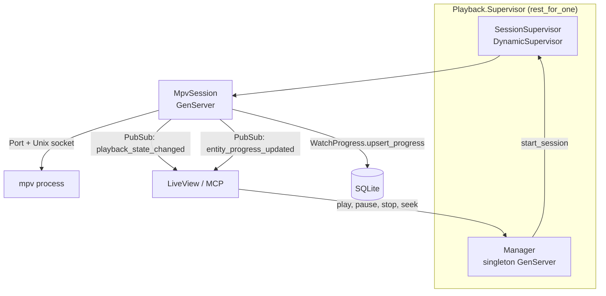
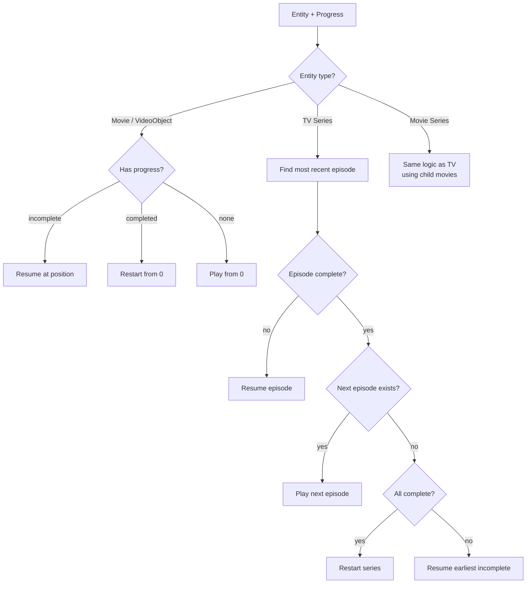

# Playback

The playback subsystem manages video playback through mpv, tracks watch progress, and provides resume/next-episode logic for the frontend.

> [Getting Started](getting-started.md) · [Configuration](configuration.md) · [Architecture](architecture.md) · [Watcher](watcher.md) · [Pipeline](pipeline.md) · [TMDB](tmdb.md) · **Playback** · [Library](library.md)

- [Architecture](#architecture)
- [Key Concepts](#key-concepts)
- [Configuration](#configuration)
- [How It Works](#how-it-works)
- [Module Reference](#module-reference)

## Architecture



## Key Concepts

**Single active session:** Only one mpv process runs at a time. Starting a new playback stops the current session first.

**Seek-aware progress tracking:** The `WatchingTracker` distinguishes continuous watching from seeking. Progress is only saved during continuous playback (20+ uninterrupted seconds). Jumps > 3 seconds reset the continuous timer.

**Completion threshold:** 90% of duration. Completion is monotonic — once marked complete, it never regresses.

**Resume algorithm:** `Resume.resolve/2` determines what to play next:



## Configuration

| Key | Default | Description |
|-----|---------|-------------|
| `playback.mpv_path` | `/usr/bin/mpv` | Path to mpv binary |
| `playback.socket_dir` | `/tmp` | Directory for MPV IPC sockets |
| `playback.socket_timeout_ms` | `5000` | Socket connection timeout after launch |

See [configuration.md](configuration.md) for the full config reference.

## How It Works

### Play Command

1. UI sends `play` with an entity UUID via the Playback Manager API
2. `Resolver.resolve/1` loads the entity and progress, then runs `Resume.resolve/2`
3. Manager stops any active session, starts a new `MpvSession` via `SessionSupervisor`
4. MpvSession launches mpv with `--input-ipc-server`, `--fullscreen`, and optional `--start=position`

### MPV IPC Protocol

MpvSession communicates with mpv via newline-delimited JSON over a Unix domain socket:

**Commands sent:**
- `["observe_property", 1, "time-pos"]` — position tracking
- `["observe_property", 2, "duration"]` — total duration
- `["observe_property", 3, "pause"]` — pause state
- `["observe_property", 4, "eof-reached"]` — end of file
- `["set_property", "pause", bool]` — toggle pause
- `["seek", position, "absolute"]` — seek to position
- `["quit"]` — close player

**Events received:**
- `property-change` for `time-pos`, `duration`, `pause`, `eof-reached`
- `end-file` with reason
- `shutdown`

### Progress Persistence

| Event | Action |
|-------|--------|
| During active watching | Save every 60 seconds |
| On pause | Save immediately |
| On stop / EOF | Save immediately |
| During seeking | No save |

Each save calls `WatchProgress.upsert_progress` with the tracker's `saveable_position` (guards against seek corruption). At 90% completion, `mark_completed` is called (monotonic).

### Progress Broadcasting

Every save broadcasts to `"playback:events"`:

```elixir
{:entity_progress_updated, entity_id, progress_summary, resume_target, child_targets_delta}
```

LiveView subscribers receive this via PubSub.

### WatchingTracker

Pure function module that gates progress persistence:

| Position Delta | Behavior |
|----------------|----------|
| <= 3 seconds | Continuous playback, accumulate time |
| > 3 seconds | Seek detected, reset continuous timer |

After 20 continuous seconds, `actively_watching` becomes `true` and `saveable_position` starts advancing.

### Display Helpers

**ProgressSummary** — computes display-ready progress for UI cards:
- Current episode (season, episode)
- Position and duration
- Episodes completed vs. total

**ResumeTarget** — computes button hints for what plays on click:
- Action: `begin`, `resume`
- Target entity/episode/movie identifiers
- Per-child targets for series grid items

## Module Reference

| Module | Description | Path |
|--------|-------------|------|
| `MediaCentaur.Playback.Manager` | Singleton, one-session-at-a-time API | `lib/media_centaur/playback/manager.ex` |
| `MediaCentaur.Playback.MpvSession` | Per-session GenServer, MPV IPC | `lib/media_centaur/playback/mpv_session.ex` |
| `MediaCentaur.Playback.SessionSupervisor` | DynamicSupervisor for sessions | `lib/media_centaur/playback/session_supervisor.ex` |
| `MediaCentaur.Playback.Supervisor` | Groups SessionSupervisor + Manager | `lib/media_centaur/playback/supervisor.ex` |
| `MediaCentaur.Playback.Resume` | Resume/next algorithm | `lib/media_centaur/playback/resume.ex` |
| `MediaCentaur.Playback.Resolver` | UUID → play params | `lib/media_centaur/playback/resolver.ex` |
| `MediaCentaur.Playback.EpisodeList` | TV episode walking helpers | `lib/media_centaur/playback/episode_list.ex` |
| `MediaCentaur.Playback.MovieList` | Movie series walking helpers | `lib/media_centaur/playback/movie_list.ex` |
| `MediaCentaur.Playback.ProgressSummary` | Display-ready progress computation | `lib/media_centaur/playback/progress_summary.ex` |
| `MediaCentaur.Playback.ResumeTarget` | Play-button hint computation | `lib/media_centaur/playback/resume_target.ex` |
| `MediaCentaur.Playback.WatchingTracker` | Seek detection, continuous-watch gating | `lib/media_centaur/playback/watching_tracker.ex` |
