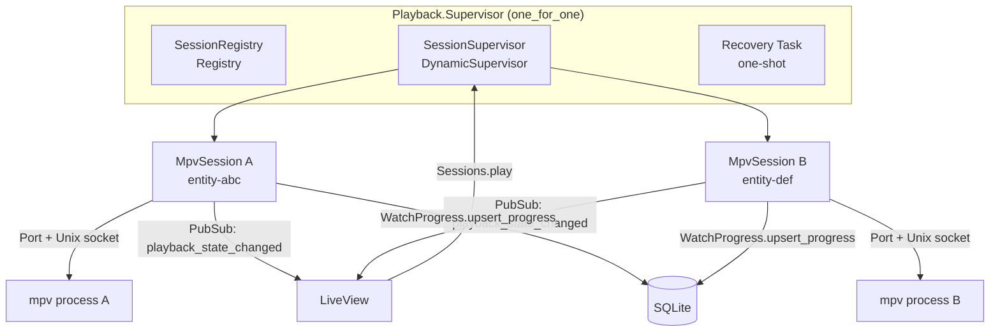
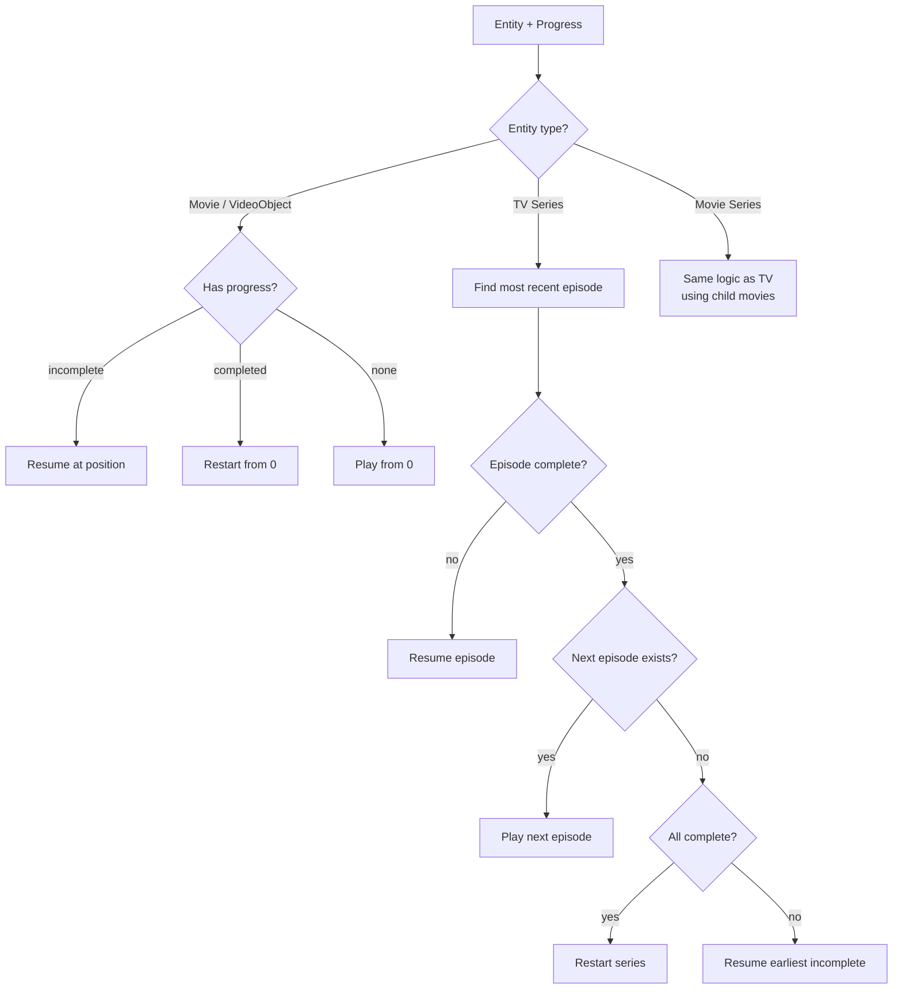

# Playback

End-user playback documentation has moved to the wiki:

- **[Playback](https://github.com/media-centarr/media-centarr/wiki/Playback)** — starting playback, resume logic, next-episode, multi-session.
- **[Keyboard & Gamepad](https://github.com/media-centarr/media-centarr/wiki/Keyboard-and-Gamepad)** — full input reference, including mpv controls.

---

## Contributor internals

The remainder of this file documents the Playback subsystem's internal architecture — MpvSession, session supervision, MPV IPC protocol, WatchingTracker, session recovery (ADR-023). This is developer-only content; end users should use the wiki links above.

### Architecture



### Key Concepts

**Multi-session playback:** Multiple mpv processes can run concurrently, one per entity. Each session is identified by its entity_id and uses an entity-scoped socket (`media-centarr-{entity_id}.sock`).

**Observation, not control:** The backend is a tracking system. The user controls mpv directly (keyboard, remote, gamepad). Each MpvSession observes position/duration/pause/eof via IPC, persists watch progress, and broadcasts state via PubSub.

**Seek-aware progress tracking:** The `WatchingTracker` distinguishes continuous watching from seeking. Progress is only saved during continuous playback (20+ uninterrupted seconds). Jumps > 3 seconds reset the continuous timer.

**Completion threshold:** 90% of duration. Completion is monotonic — once marked complete, it never regresses.

**Resume algorithm:** `Resume.resolve/2` determines what to play next:



### How It Works

#### Play Command

1. UI calls `Sessions.play/1` with an entity UUID
2. `Resolver.resolve/1` loads the entity and progress, then runs `Resume.resolve/2`
3. Sessions checks Registry for duplicates, then starts a new `MpvSession` via `SessionSupervisor`
4. MpvSession registers in `SessionRegistry` by entity_id
5. MpvSession launches mpv with `--input-ipc-server`, `--fullscreen`, and optional `--start=position`

#### MPV IPC Protocol

MpvSession communicates with mpv via newline-delimited JSON over a Unix domain socket:

**Commands sent:**
- `["observe_property", 1, "time-pos"]` — position tracking
- `["observe_property", 2, "duration"]` — total duration
- `["observe_property", 3, "pause"]` — pause state
- `["observe_property", 4, "eof-reached"]` — end of file
- `["quit"]` — close player on EOF

**Events received:**
- `property-change` for `time-pos`, `duration`, `pause`, `eof-reached`
- `end-file` with reason
- `shutdown`

#### Progress Persistence

| Event | Action |
|-------|--------|
| During active watching | Save every 60 seconds |
| On pause | Save immediately |
| On stop / EOF | Save immediately |
| During seeking | No save |

Each save calls `WatchProgress.upsert_progress` with the tracker's `saveable_position` (guards against seek corruption). At 90% completion, `mark_completed` is called (monotonic).

#### Progress Broadcasting

Every save broadcasts to `"playback:events"`:

```elixir
{:entity_progress_updated, %{
  entity_id: entity_id,
  summary: summary,
  resume_target: resume_target,
  child_targets_delta: child_targets_delta,
  changed_record: changed_record,
  last_activity_at: last_activity_at
}}
```

State changes broadcast with entity_id:

```elixir
{:playback_state_changed, entity_id, state, now_playing}
```

LiveView subscribers receive both via PubSub.

#### Session Recovery (ADR-023)

On startup, a one-shot Task scans the socket directory for `media-centarr-*.sock` files. For each socket found, it probes mpv for the current path and position, resolves the entity, and starts a reconnecting MpvSession. Dead socket files are cleaned up.

#### WatchingTracker

Pure function module that gates progress persistence:

| Position Delta | Behavior |
|----------------|----------|
| <= 3 seconds | Continuous playback, accumulate time |
| > 3 seconds | Seek detected, reset continuous timer |

After 20 continuous seconds, `actively_watching` becomes `true` and `saveable_position` starts advancing.

#### Display Helpers

**ProgressSummary** — computes display-ready progress for UI cards:
- Current episode (season, episode)
- Position and duration
- Episodes completed vs. total

**ResumeTarget** — computes button hints for what plays on click:
- Action: `begin`, `resume`
- Target entity/episode/movie identifiers
- Per-child targets for series grid items

### Module Reference

| Module | Description | Path |
|--------|-------------|------|
| `MediaCentarr.Playback.Sessions` | Public API facade (stateless) | `lib/media_centarr/playback/sessions.ex` |
| `MediaCentarr.Playback.SessionRegistry` | Registry wrapper, entity_id lookup | `lib/media_centarr/playback/session_registry.ex` |
| `MediaCentarr.Playback.MpvSession` | Per-session GenServer, MPV IPC observer | `lib/media_centarr/playback/mpv_session.ex` |
| `MediaCentarr.Playback.SessionSupervisor` | DynamicSupervisor for sessions | `lib/media_centarr/playback/session_supervisor.ex` |
| `MediaCentarr.Playback.SessionRecovery` | Multi-socket orphan recovery | `lib/media_centarr/playback/session_recovery.ex` |
| `MediaCentarr.Playback.Supervisor` | Groups Registry + SessionSupervisor + Recovery | `lib/media_centarr/playback/supervisor.ex` |
| `MediaCentarr.Playback.Resume` | Resume/next algorithm | `lib/media_centarr/playback/resume.ex` |
| `MediaCentarr.Playback.Resolver` | UUID → play params | `lib/media_centarr/playback/resolver.ex` |
| `MediaCentarr.Playback.EpisodeList` | TV episode walking helpers | `lib/media_centarr/playback/episode_list.ex` |
| `MediaCentarr.Playback.MovieList` | Movie series walking helpers | `lib/media_centarr/playback/movie_list.ex` |
| `MediaCentarr.Playback.ProgressSummary` | Display-ready progress computation | `lib/media_centarr/playback/progress_summary.ex` |
| `MediaCentarr.Playback.ResumeTarget` | Play-button hint computation | `lib/media_centarr/playback/resume_target.ex` |
| `MediaCentarr.Playback.WatchingTracker` | Seek detection, continuous-watch gating | `lib/media_centarr/playback/watching_tracker.ex` |
