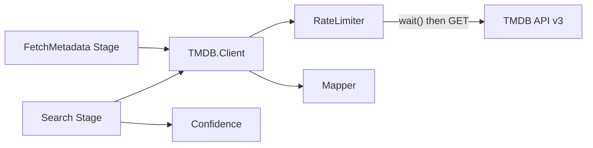

# TMDB Integration

The TMDB subsystem provides rate-limited access to [The Movie Database API v3](https://developer.themoviedb.org/docs) for searching titles, fetching metadata, and resolving artwork URLs.

> [Architecture](architecture.md) · [Watcher](watcher.md) · [Pipeline](pipeline.md) · **TMDB** · [Playback](playback.md) · [Library](library.md) · [Input System](input-system.md)

- [Architecture](#architecture)
- [Key Concepts](#key-concepts)
- [Configuration](#configuration)
- [How It Works](#how-it-works)
- [Module Reference](#module-reference)

## Architecture



## Key Concepts

**Rate limiting:** A sliding-window GenServer allows 30 requests per second. Callers block (sleep) until a slot opens — no mailbox buildup.

**Confidence scoring:** Search results are scored against parsed filenames using Jaro string distance plus contextual bonuses. Scores above the threshold (default 0.85) are auto-approved; below it, the file is queued for human review.

**Response mapping:** Raw TMDB JSON is mapped to schema.org attribute names (`title` → `name`, `overview` → `description`, `release_date` → `date_published`, etc.) before reaching the library domain.

## Configuration

Both values are **DB-managed** as of v0.14.0 / v0.15.0. They are edited in **Settings → TMDB** and persisted via `MediaCentarr.Settings.Entry`; the TOML file no longer carries them. `MediaCentarr.Config.get/1` reads the DB under the hood.

| Key (via `Config.get/1`) | Default | Description |
|--------------------------|---------|-------------|
| `:tmdb_api_key` | `nil` | TMDB API key ([get one here](https://www.themoviedb.org/settings/api)) |
| `:auto_approve_threshold` | `0.85` | Minimum confidence score for auto-approval |

See [configuration.md](configuration.md) for the full DB-managed config reference.

## Capability gating

UI surfaces that depend on TMDB — **Rematch** in the detail view, **Search TMDB** in Review, and **Track New Releases** under Release Tracking — only appear once `MediaCentarr.Capabilities.tmdb_ready?/0` returns `true`. That predicate is true when:

1. An API key is configured.
2. The most recently persisted **Test connection** result was `:ok`.

Saving any field in the TMDB section clears the stored test result, so the UI collapses back to the "please test" state until the user re-verifies. The test-connection button and its result storage live under `MediaCentarr.Capabilities.save_test_result/2` + `load_test_result/1`, with a broadcast on `capabilities:updates` so subscribed LiveViews refresh in place.

When adding a new TMDB-dependent feature, render its affordance behind `Capabilities.tmdb_ready?/0` rather than directly checking key presence — that's the only way to pick up the "configured but untested" state correctly.

TMDB is consumed by three contexts: the Pipeline (Discovery + Import + Image downloads), `ReleaseTracking.Refresher`, and `Review.Rematch`. Capability readiness applies to all three.

## How It Works

### Client

HTTP client using `Req` with base URL `https://api.themoviedb.org/3`. Endpoints:

| Function | Endpoint | Purpose |
|----------|----------|---------|
| `search_movie/3` | `GET /search/movie` | Search movies by title + optional year |
| `search_tv/3` | `GET /search/tv` | Search TV series by title + optional year |
| `get_movie/2` | `GET /movie/{id}` | Movie details with credits, release dates, images |
| `get_tv/2` | `GET /tv/{id}` | TV series details with images |
| `get_season/3` | `GET /tv/{id}/season/{n}` | Season details with episode list |
| `get_collection/2` | `GET /collection/{id}` | Movie collection details with images |

Every request calls `RateLimiter.wait()` first and emits telemetry for wait duration and request latency.

### Confidence Scoring

```
score = min(base + year_bonus + position_bonus, 1.0)
```

| Component | Value | Condition |
|-----------|-------|-----------|
| Base | 0.0–1.0 | `String.jaro_distance/2` of normalized titles |
| Year bonus | +0.08 | Parsed year matches TMDB year |
| Position bonus | +0.05 | Result is first in search results |

**Normalization:** Lowercase, strip non-alphanumeric characters (except spaces), collapse whitespace.

Top 5 results are scored. The highest-scoring result is selected.

### Mapper

Maps TMDB JSON fields to domain attributes:

| TMDB Field | Domain Attribute |
|------------|------------------|
| `title` / `name` | `name` |
| `overview` | `description` |
| `release_date` / `first_air_date` | `date_published` |
| `genres[].name` | `genres` |
| `runtime` | `duration` (ISO 8601) |
| `vote_average` | `aggregate_rating_value` |
| `credits.crew[job=Director]` | `director` |
| `release_dates` (US cert) | `content_rating` |

Image extraction prefers English logos (`iso_639_1 == "en"`). Roles: `poster`, `backdrop`, `logo`.

Image CDN URL: `https://image.tmdb.org/t/p/original{path}`

### Rate Limiter

Sliding window using Erlang `:queue`:

1. On `wait()` call, GenServer checks if queue length < 30 (rate limit)
2. If under limit: record timestamp, return immediately
3. If at limit: calculate sleep duration from oldest timestamp, return `{:retry_after, ms}`
4. Caller sleeps and retries — GenServer never blocks

## Module Reference

| Module | Description | Path |
|--------|-------------|------|
| `MediaCentarr.TMDB.Client` | HTTP client, endpoint methods | `lib/media_centarr/tmdb/client.ex` |
| `MediaCentarr.TMDB.Confidence` | Jaro distance scoring | `lib/media_centarr/tmdb/confidence.ex` |
| `MediaCentarr.TMDB.Mapper` | JSON → domain attribute mapping | `lib/media_centarr/tmdb/mapper.ex` |
| `MediaCentarr.TMDB.RateLimiter` | Sliding window rate limiter | `lib/media_centarr/tmdb/rate_limiter.ex` |
